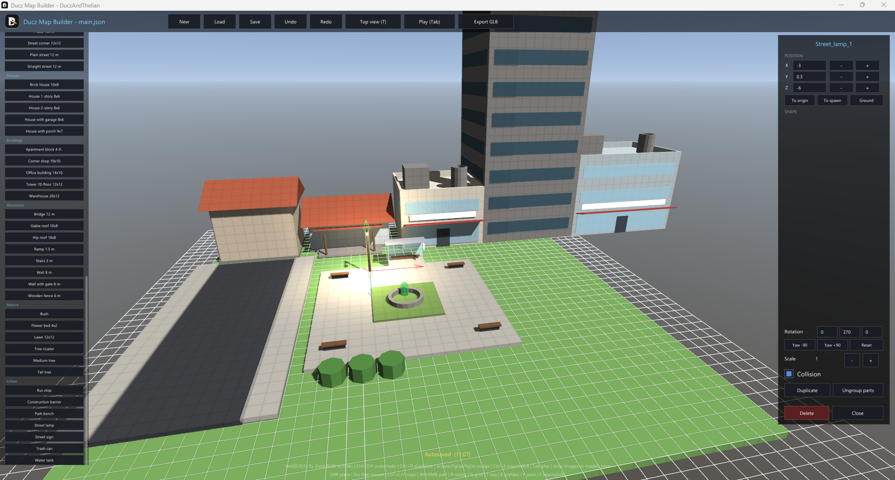
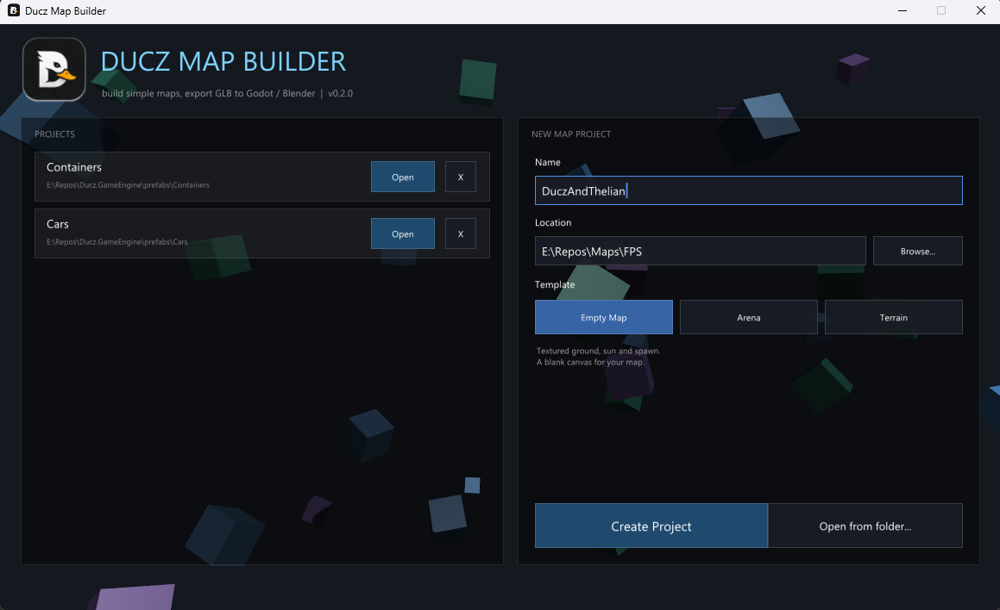
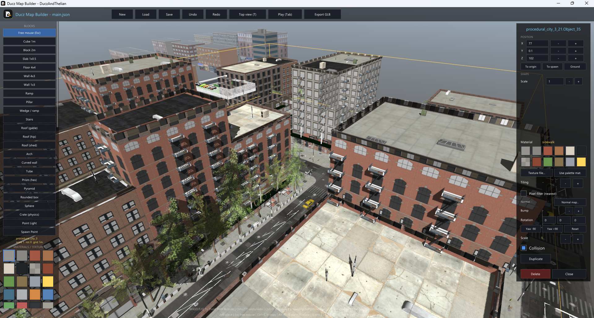
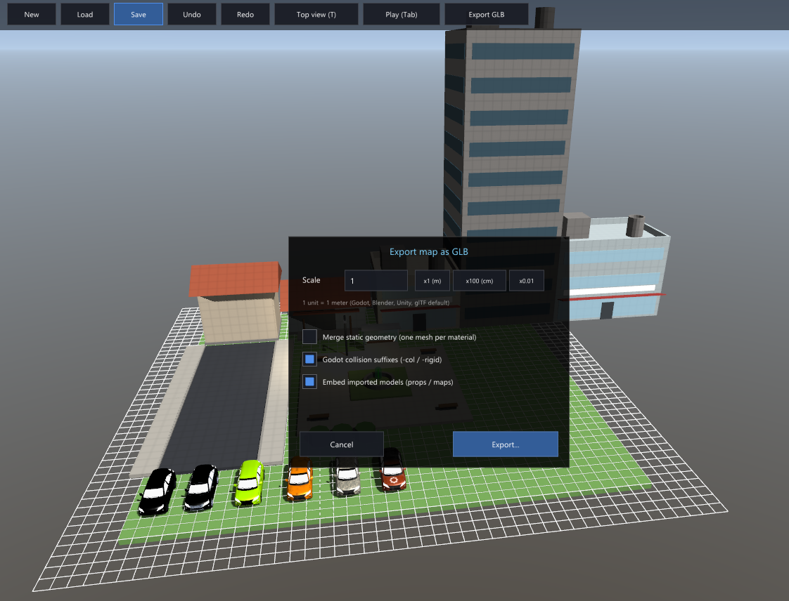
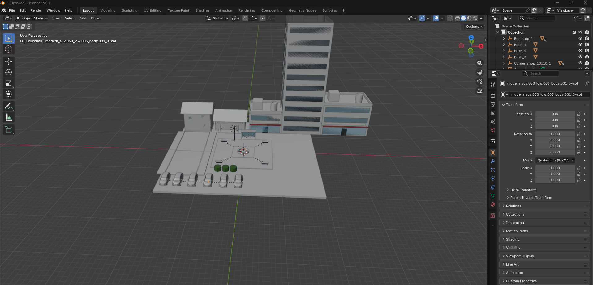

# Ducz Map Builder

**Build simple 3D maps fast, texture them with a right-click, export them as GLB.**

   

<p align="center">
  
</p>

Ducz is a small C# toolset for greybox / kit-bash level building: place blocks, walls, ramps
and props on a grid, drop textures onto them, walk through the result, then export a `.glb`
that opens directly in **Godot** (with collision generated on import), **Blender**, Unity or
any glTF viewer.

The map builder runs on the **Ducz Engine**, a compact OpenGL 3.3 game engine written in
plain C# (scene tree, renderer, physics, UI, audio, glTF/FBX import). The engine is still
usable on its own - see the docs - but the map builder is the product.

```
Launcher (create a map project) → Map Builder (build, texture, play-test) → Export GLB → Godot / Blender
```

## The story

I spent a few months on this project with one goal: a simple, lightweight, customizable map
builder. For a while I was aiming to polish it to perfection and ship it on Steam - but it is
no longer where my focus is, and it was too much work to let something this cool sit rotting in
my local files. So I'm releasing it for free, open to use and distribution. I hope it's useful
to someone. Fork it, learn from it, build something with it.

## Quick start

Requirements: [.NET 8 SDK](https://dotnet.microsoft.com/download/dotnet/8.0) and any GPU
with OpenGL 3.3 (Windows, Linux or macOS).

```bash
git clone https://github.com/LuanDucate/Ducz.GameEngine.git
cd Ducz.GameEngine
dotnet run --project src/Ducz.Tools.Launcher        # create a project, opens the map builder
# or edit a scene file directly:
dotnet run --project src/Ducz.Tools.SceneEditor -- my-map.json
```

Then in the map builder:

1. Pick a block on the left, **left-click** to place it (drag to paint a row,
   **Shift+drag** to fill a rectangle, **G** changes the grid, **T** switches to a
   top-down map view).
2. **Right-click** an object → choose a texture (`Texture file...`), pick a palette material,
   adjust tiling, rotate, scale, toggle collision - or just **drop an image file** onto it.
3. Select an object and **drag the coloured axis arrows** to move it; **Tab** to walk around
   the map, **Ctrl+E** to export `Export/<MapName>.glb`.
4. In Godot: drop the `.glb` into the project - static geometry already carries the `-col`
   suffix, so Godot creates the collision for you.

## Features

- **Grid-based building** - blocks, slabs, floors, walls, pillars, spheres, physics crates,
  point lights, spawn point; snapping (0.05 – 4 m grid), stacking, drag-paint, rectangle fill,
  duplicate, nudge, undo/redo, top-down view
- **Building shapes** - wedges/ramps with an editable slope, stairs, gable/hip/shed roofs,
  arches, curved walls, tubes, prisms, pyramids and rounded boxes, each with an exact
  triangle collider
- **Move gizmo** - grab the X/Y/Z axis arrows on a selected object and drag it into place,
  snapping to the grid; moves a whole multi-selection together
- **Editable objects** - right-click anything to type its real dimensions, slope in degrees,
  step count, arc angle, rotation per axis...
- **Texturing by right-click or drag & drop** - image files become materials (copied into
  the project), swatch palette with thumbnails, per-material tiling and pixel filtering,
  world-space UVs so textures keep their density on every block size
- **High-quality materials** - normal and roughness maps (auto-detected from `_normal`/`_rough`
  sibling files), adjustable bump strength, and one material per box face
- **Prefabs** - 37 ready-made pieces (houses, streets, blocks of flats, trees, lamp posts,
  benches, fences...) that drop in assembled; **Alt+click** edits any part of one, **Ctrl+B**
  saves your own
- **Reachability overlay** - press **F** to flood-fill the walkable map from the spawn: green
  where you can walk, red where a platform is isolated, so multi-level maps actually connect
- **Autosave** - your map is written to disk on its own a few seconds after you stop editing
- **Prototype textures** - every new map starts on a 1 m grid palette, so a blockout reads as
  deliberate without importing anything
- **Modular packs** - import a kit and browse its pieces with **P**, placing each one where you click
- **Multi-selection** - rubber-band several objects and move, scale, rotate, copy or delete them together
- **Copy & paste** - Ctrl+C/Ctrl+V through the system clipboard, between open maps
- **Props** - drop GLB/glTF/FBX/OBJ/DAE/STL models onto the window and place them like blocks
- **GLB export** - PBR materials with embedded textures, `KHR_texture_transform`,
  `KHR_lights_punctual` lights, terrain, embedded props, marker nodes with metadata,
  Godot `-col`/`-rigid` import suffixes, optional merge-by-material
- **Play mode** - press Tab and walk through the map with the built-in third-person player
- **JSON scene format** - the map is a small readable JSON file, diffable and hand-editable

## From blockout to engine

<table>
<tr>
<td width="50%"><br><b>Start a project</b> - the launcher creates or opens a map from a template.</td>
<td width="50%"><br><b>Drop in models</b> - GLB / glTF / FBX / OBJ dragged straight onto the window, placed like blocks.</td>
</tr>
<tr>
<td width="50%"><br><b>One-key export</b> - <code>Ctrl+E</code> writes a <code>.glb</code> of the whole map.</td>
<td width="50%"><br><b>Opens anywhere</b> - the exported GLB in Blender, carrying <code>-col</code> collision for a one-drop Godot import.</td>
</tr>
</table>

## Documentation

| Document | Contents |
| --- | --- |
| [Map Builder](docs/map-builder.md) | Controls, blocks, textures, props, play mode |
| [Prefabs](docs/prefabs.md) | Ready-made houses, streets and trees - and how to make your own |
| [Prototype textures](docs/textures.md) | The 1 m grid every new map starts with |
| [GLB Export](docs/glb-export.md) | What goes into the file, Godot import hints, options |
| [Launcher & Projects](docs/launcher.md) | Project manager, templates and the project folder format |
| [JSON Scenes](docs/json-scenes.md) | The scene file format the builder reads and writes |
| [Roadmap](docs/roadmap-mapbuilder.md) | Where the project is going |
| [Docs for AI](docs/Docs_for_IA/README.md) | Knowledge base that teaches an AI/RAG to generate map projects from a prompt |
| **Engine reference** | |
| [Getting Started](docs/getting-started.md) | Using the engine as a library |
| [Core Concepts](docs/core-concepts.md) | Nodes, scene tree, lifecycle, input, time, tweens |
| [Rendering](docs/rendering.md) | Meshes, materials, lights, environment, cameras, particles |
| [Assets & Models](docs/assets.md) | Textures, glTF import, the asset cache |
| [Animation](docs/animation.md) | Animation player, skeletons, clips, bone attachments |
| [Physics](docs/physics.md) | Bodies, shapes, character controller, raycasts, areas |
| [UI](docs/ui.md) | Canvas, anchors, controls, fonts and theming |
| [Audio](docs/audio.md) | Clips, WAV files, procedural sound, 3D audio |
| [AI](docs/ai.md) | State machines, pathfinding, steering |
| [World Building](docs/world.md) | Terrain, grid maps, prefabs, camera rigs, saves |
| [API Reference](docs/api-reference.md) | Every public type at a glance |
| Tutorials | [Your First Game](docs/tutorials/your-first-game.md), [Importing Models](docs/tutorials/importing-models.md) |

## Repository layout

```
src/Ducz.GameEngine/          the engine library (rendering, scene, physics, UI, audio, import, GLB export)
src/Ducz.Tools.SceneEditor/   the Map Builder
src/Ducz.Tools.Launcher/      project manager (create/open map projects, templates)
src/Prefabs/                  the prefab library shipped with the editor
src/Branding/                 logo, icons (.ico) used by the tools
build/publish.ps1             self-contained release build (dist/DuczMapBuilder)
site/                         the project landing page (served on GitHub Pages)
.github/workflows/            CI: deploy the page, build a release on a version tag
docs/                         manual
```

## Releases

Releases are built automatically. Pushing a version tag runs the
[release workflow](.github/workflows/release.yml), which publishes a self-contained build.


Grab a finished build from the [Releases page](https://github.com/LuanDucate/Ducz.GameEngine/releases).

To produce the same zip locally - for testing, or a build the CI doesn't cover - run the script
the workflow calls:

```powershell
pwsh build/publish.ps1 -Zip     # -> dist/DuczMapBuilder-<version>-win-x64.zip
```

## Design philosophy

1. **Simple maps, fast.** Blocks on a grid, textures by right-click, one key to export.
2. **The map is data.** A small JSON file is the source; GLB is generated from it any time.
3. **Zero-asset start.** Procedural checkerboard materials and primitive blocks mean you can
   block out a level before you own a single texture.
4. **Small, readable code.** Every system exists in a deliberately simple form you can read
   and extend.

## Known limitations

- Blinn-Phong to PBR conversion on export is an approximation (fine for diffuse textures).
- Rigid bodies simulate linear motion only; one shadow-casting directional light; WAV audio only.
- No sculpted terrain by hand (procedural and heightmap terrain are supported).

## Contributing

This is a personal project I've opened up - issues and pull requests are welcome, but it is
shared as-is and I can't promise fast reviews or a support schedule. If you build something
with it, I'd love to hear about it. Fork freely.

## License

[MIT](LICENSE) - do whatever you want, attribution appreciated. Third-party components are
listed in [THIRD-PARTY-NOTICES.md](THIRD-PARTY-NOTICES.md).
